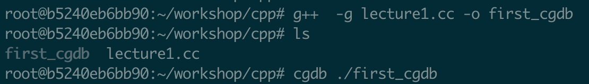
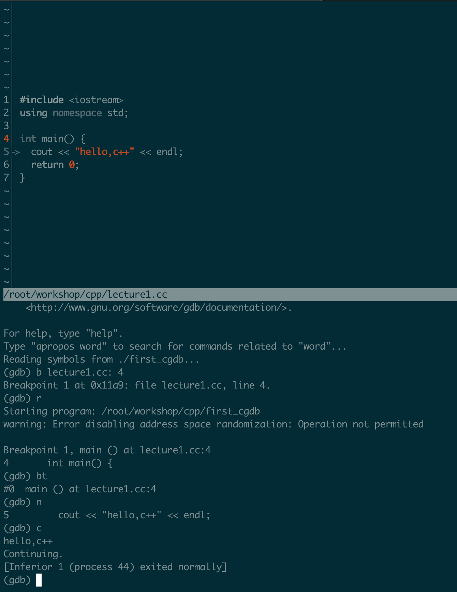
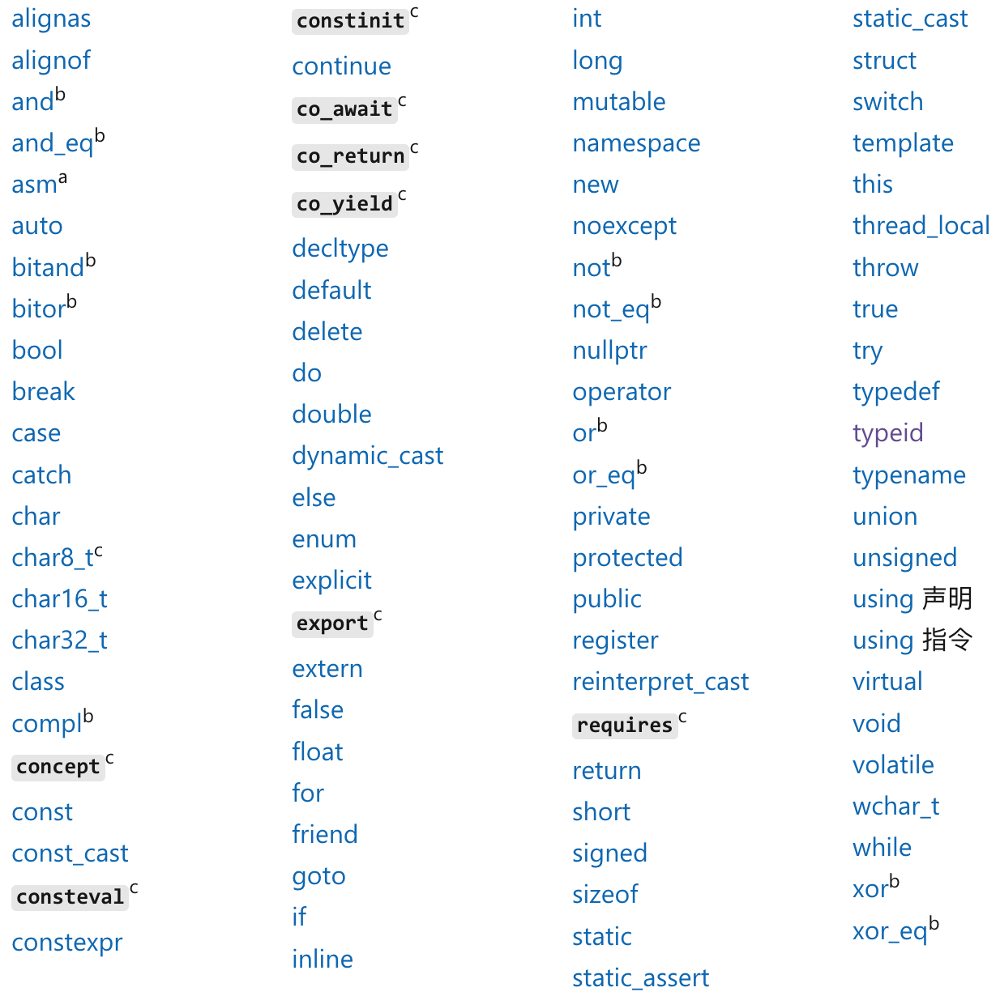

[toc]

<div style="page-break-before: always;"></div>

大家好，这门课程是关于c++的。

c++有广泛的应用场景，尤其是对性能要求比较高的场景如搜索，广告，推荐和游戏引擎，c++基本是首选的编程语言。c++是功能非常强大，支持函数，类，模板等，新的标准还支持线程，协程等非常实用的功能。同时c++也是比较复杂的编程语言，尤其是为了写出更高效的代码，需要了解它底层的一些实现，如内存部局，虚函数等。

这门课力争给大家比较全面地展示c++，同时也注重深度和实战：在详细介绍c++的同时，还在课程中穿插了“经验之谈”，“高级话题”和“实战”，并且在最后一章和实现一个简单的搜索引擎。希望这种既有理论又有实战，既学知识又了解工业界的课程方式能让大家快速掌握c++，并早日成为优秀的c++程序员。

本课程适合零基本但希望从事c++编程的朋友。另外本课程是基于linux编程环境，主要使用的工具有vim，g++和gdb，如果你比较熟悉其它环境如windows和visual studio，应该也没有问题，因为我们是讲c++，除了编程工具外不会涉及太多环境的问题。

# hello c++

本章以一个简单的c++例子为引，简单介绍编程环境和如何调试。

## vim
vim是一款功能强大的编辑器，配置得当的话可以极大提高编程效率。windows，linux和macos下都有相应vim版本，可以搜索相关教程自行安装，建议安装最新版本。

下面以linuxg环境为例讲解。

### 在终端打开vim
首先cd到相应的工作目录，然后输入vim回车即可打开vim。也可以从vim直接打开文件，只要将文件名跟在vim后即可。

### 两种模式：插入模式和普通模式：
按下“ESC”后进入普通模式，只能浏览不能编辑；按下“i”后进入插入模式可以编辑。
vim的各种命令都是在普通模式下执行的，如打开文件，退出，查找等等。

### 打开&&保存文件&&退出
":e"：命令后加空格跟上文件名，回车即可打开文件

":w"：保存文件

":q"：退出vim

":wq"：保存并退出

### 浏览
在普通模式下试着分别按下“h”,"j","k","l"，看看效果。
翻屏命令：ctrl+u或者ctrl+d。

### 输入
普通模式下，“shift+i”：在行首开始输入，"shift+a"：在行尾开始输入，输入“o”将在下一行输入。

### 搜索
"/any_thing_to_search"，然后回车

## g++
linux下编程c++代码使用的编译器是g++，如果没有的话可以按网上教程安装一下。

### 编译命令
g++编译代码的命令很简单，在控制台下输入g++和c++代码的文件名即可，如：

g++ my_cpp_file.cc

其中my_cpp_file.cc是一个c++代码文件，后缀“.cc”表示是c++类型的文件。也有的人习惯用".cpp"代替".cc"，也是可以的。

### 常用选项
g++有很多选项，在编译时加上后可实现相应功能。下面简单介绍一些常用选项：

-g: 在编译生成的可执行文件中保留调试信息，供调试时使用

-O: 编译优化级别，后面可以追加数字0～3，数值越大表示优化级别越高

-I: 指定头文件位置。c++的代码文件可以简单分两类，一个是上面的".cc"，另外一种是头文件，以“.h”结尾。
编译时需要在命令中指定这两种文件。头文件一般集中放在一个文件夹下，"-I"就是用来指定文件夹的位置，这样编译器就能
找到所有这些文件，从而正常编译。

-L&&-l: 库的位置和名字。c++语言有很多现成的库，如linux环境下的多线程库pthread。如果在代码中使用的这些库，就需
要在编译命令中指定这些库的名字。另外这些库不一定放在操作系统的标准位置，那么g++就找不到，又或者是从网上下载或
自己生成一些库，这时就需要指定库所在的位置，以便g++能够找到。-L和-l就是分别告诉g++这些库的位置和名字。

-o: 指定可执行文件名字。默认生成的可执行文件名字是“a.out”，可以通过这个选项更改。o表示“output”。

## 一个最简单的c++程序
下面用一个非常非常简单的程序展示一下c++的样子，让大家有个初步印象。这个代码只是简单地打印“”hello,c++"。
但麻雀虽小，五脏俱全，我们仍然可以通过这一小段代码了解c++的很多知识。

### 创建文件、编译并运行
1. 启动vim，创建并打开文件my_hello_cpp.cc：

   vim my_hello_cpp.cc

2. 然后输入以下内容：
```c++
#include <iostream>
using namespace std;

int main() {
    cout << "hello,c++" << endl;
    return 0;
}
```
3. 用":wq"保存并关闭文件。

4. 使用如下编译命令：
   g++ my_hello_cpp.cc

5. 用"ls"查看目录下，应该有新生成可执行文件a.out

6. 运行这个文件：
   ./a.out

如果一切正常的话会打印出来“hello,c++"。

### 解释一下这段代码
- include <iostream>
  前面提到过c++的头文件，一般把类定义和公共函数声明放到头文件，哪个地方要用的时候再包含进来，这样就可以重复使用了。这里，iostream是c++标准里的输入输出头文件，使用include就表示这段代码要用输入输出，所以要把iostream包含进来。
  
  这行也可以写成现在这样：include "iostream"，但这样性能会稍差一些，原因是用“<>”时编译器会先从操作系统文件找这个头文件，而用""时会优先从用户指定位置开始查找。
  
- using namespace std
  namespace是c++一个关键字，表示名字空间。所谓空间就是把代码分割开，这样即使在两个空间有相同的名字编译器也不会报错，后面我们会详细说这个。
  

具体到这行，就是表示下面的代码要使用std这个名字空间里的所有定义和声名（这不是个好作法，但作为例子没问题）。

- int
  interger的简写，这个表示main函数运行结束后会返回一个int类型的数值。

- main
  c++代码必须有一个名字为main的函数，这是操作系统执行这段代码的入口函数。没有这个函数编译器会报错。

- 括号{}
  在c++里，函数里的内容必须放到一对“{}”括号里。

- cout && endl
  这两个都是来自于名字空间std，cout用于输出内容，endl用于换行，即光标移到下一行。

- return 0
  表示现在要结束函数的运行，并返回一个0。
  

后面可以看到，return也可以不返回任何值。

- 分号“;”
  分号表示一条代码语句的结束，也是必须的。后面会详细讲。

## 添加注释
在代码的关键位置添加注释是个好习惯，这样方便别人理解和维护。c++有两种添加注释的方法：
- 方法1
```c++
#include <iostream>
using namespace std;

/*这是一行注释*/
/*
  这是
  一条
  多行
  注释*/
int main() {
    cout << "hello,c++" << endl;
    return 0;
}
```

- 方法2
```c++
#include <iostream>
using namespace std;
// 这是一行注释
// 这是另一行
int main() {
    cout << "hello,c++" << endl;
    return 0;
}
```

## gdb && cgdb
写程序难免遇到问题，这时候就需要调试代码。linux下的调试工具是gdb和cgdb，后者可以分屏跟踪显示代码，能提高效率，其它方面和gdb是一样的。这里简单介绍gdb的功能。

### 两种启动方式
有两种启动的方式：

- 1. gdb + 可执行文件名，如："cgdb + ./a.out"
- 2. 先启动cgdb，再通过“file”命令加载可执行文件

启动后如果不加断点，输入"run"或者“r”并回车就可以像在控制台一样正常运行程序；如果先加上断点再run（r）那么程序会执行到断点处停止。

### 设置断点
调试时经常打断点，程序执行到这些位置会自动停下来。gdb中，使用“break”或者“b”命令可以设置断点，格式为“break 文件名:行号”。
通过"info break"可以查看所有断点信息，通过“del 断点编号”可以删除断点。

此外还可以设置条件断点，即满足条件时才让程序停下来。

### 执行下一步
在调试时，一般会一行一行跟踪程序执行，让程序执行下一行的命令是“next”或者“n”。

### 继续执行
有时程序当前运行到的位置距离断点位置比较远，如果不停输入“next”就比较麻烦，这里可以直接输入“continue”或者“c”，让程序直接
运行到断点停下。

### 查看调用栈桢
当想查看当前的调用栈时，可以输入“backtrace”或者“bt”，就能输出从main到当前函数所调用的一串函数名和参数。

调用栈前有编号，通过“frame 编号”或者“f 编号”可以切换到相应的栈桢进一步调试。

## 实战：初试gdb

- 使用-g选项重新编译

  g++ -g my_hello_cpp.cc

- 启动

  cgdb ./a.out

- 在main开始处设置断点

  break my_hello_cpp.cc:4

- 运行开始调试

  r

- 查看调用栈桢

  bt

- 继续运行到结束退出

  c

参考命令





# 基本类型及变量

本章介绍c++的基本类型以及变量。程序总要处理各种各样的数据，数据又由不同的类型来表示，比如年龄一般用整数类型表示，身高则适合用浮点类型表示，更复杂一点如定义一个学生类型，这在c++里是用结构体或者类类型实现的。

**类型可以简单认为是对计算机里bit位的解释**。例如对于同一个十六进制数字0xFFFFFFFF，有符号整型将它解释为-1，无符号数将它解释为4294967295。

**变量则是“内存”+“类型”**。变量首先占用一些内存，如int一般4字节，double一般8字节。变量的类型则决定了怎么去解释这些内存。

c++的类型可以分两大类，一是c++自带的所谓内置类型，如整型，浮点型等，二是我们自己定义的，如各种结构体和类类型。下面分别介绍。

## 内置类型

内置类型是c++语言自带的，可以在代码里随处使用。

### 整型

c++整型是以下三种类型的统称：

- 整数

  整数一般用来表示年龄，个数等等这些离散型的数值。整数的关键字有short，int和long三个，其中short一般占2字节，int占4字节，long占8字节，这些值可通过sizeof得到：

  ```c++
  // 试一下：
  cout << sizeof(int) << endl;
  ```

  整数分有符号和无符号两种，分别通过在关键字前加signed或unsigned进行定义，如unsigned int表示无符号整数，signed int表示有符号整数。有符号值可以表示正数负数和0，无符号数只能表示正数和0。默认是有符号的，即int表示有符号。

  ```c++
  // 整数可以通过各种常量初始化
  int a = 123;  // 通过十进制初始化
  int b = 0xFF; // 通过十六进制初始化
  int c = 3.14; // 通过浮点数初始化。3.14转为整数时被截断为3，所以c等于3
  ```

  在实践中，**不要有符号和无符号整数混合使用**，否则可能带来非常意外的问题，常见的如判断条件失效导致的死循环。

- 字符型

  顾名思义，字符型是用来存储字符的。字符型在内存占1个字节。

  计算机中有128个ASCII码，值从0～127，包括常见的a~z，A~Z和0~9的数字。

  字符型变量既可以通过字符初始化也可以通过整数初始化：

  ```c++
  // 试一下：
  char a = 'E';
  char b = 69;  // 0~127之间的整数
  cout << a << "," << b << endl;
  ```

- 布尔型

  在逻辑运算中会用到布尔型，它只可以取两个值之一：true或false。布尔型在内存也是占1个字节。

  布尔型可能通过false，true和整数初始化：

  ```c++
  bool a = true;
  bool b = false;
  bool c = 123;
  bool d = 0;
  ```

  非0的整数都将布尔型变量初始化为true，0则为false。

  布尔型值也能得到整数：

  ```c++
  bool a = false;
  bool b = true;
  cout << a << endl;  // 打印0
  cout << b << endl;  // 打印1
  ```

### 浮点型

浮点型包含两种类型：float和double，前者为单精度，一般占4字节，后者为双精度，一般为8字节大小。

```c++
// 加f强加为float类型
float f = 3.14f;
// 默认是double
double d = 0.618;
```

浮点型用来存储连续性数值，如身高，速度，价格等等。

## 变量

### 什么是变量？

变量可以理解为一块内存的标识，在代码中可以对它进行规定的读写操作。c++是强类型语言，代码中的变量必须有类型。例如我们可以定义这些变量：

```c++
// 定义一个整型变量
int a = 0;

// 定义一个char型变量
char c = 'c';

// 定义一个bool型
bool b = true;

// 定义一个无符号整型变量
unsigned int a = 0;
```

在学习类类型后还可以定义一个类类型的变量。

总之，变量就是指一块内存，而这块内存的意义由定义变量时指定的类型决定，或以是整型，浮点型或者类类型。

### 变量命令规则

变量是由一串字符组成的，只能包含字母，数字和下划线，并且不能以数字开头。下面是些例子：

```c++
// 有效的变量定义
int abcd = 0;
int ab_c_2 = 2;
int _ab_3 = 3;

// 无效的变量定义：
int 3_ad = 3;
int ab& = 4;
int ab+ = 5;
```

另外，c++保留的关键字也不能用于变量名，如const, do, if, for等等。完整的关键字可参考下图：


该图来自[这里](https://learn.microsoft.com/zh-cn/cpp/cpp/keywords-cpp?view=msvc-170)

### 变量初始化

在定义变量时给定变量的值，就是初始化：

```c++
// 初始化变量a为123
int a = 123;

// 初始化字符串为"this_is_a_string"
std::string str = "this_is_a_string";

// 初始化浮点型变量为1.234
float height = 1.234;
```

还可以在一行初始化多个类型相同的变量：

```c++
int a = 123, b = 456;
```

除了上述方式，还可以用括号初始化：

```c++
int a(555);
std::string str("a string again.");
```

初始化和赋值是不一样的，例如：

```c++
int a;
a = 888;
```

在这个例子中，先定义了变量a，然后再对它进行赋值888。赋值是在定义了变量后再修改变量的值，初始化是在定义时直接修改变量值。

### 声明和定义

声明和定义的区别是，前者不占用内存而后者是占用的：

```c++
// 声明
extern int a;
extern float f;
extern double d;

// 定义
int a = 123;
float f = 3.3333;
double d = 8.8888;
```

声明只是向编译器说明有这样一样一个类型和名称的变量，但它是在其它地方定义好的。在声明之后的代码里可以使用这个变量。

另外，声明可以出现多次，但定义只能有一次，这是因为定义是占用存储空间的，同一个变量不能重复占用空间。

声明一个常见的用法是，在公共头文件声明变量，在“.cc”文件里定义变量，这样其它地方要使用这个变量时，只要通过include包含头文件即可。

## 枚举

经常遇到这样的情况，就是一个变量的取值范围是有限个数的，当然可以直接用整型来处理，但用枚举会更清晰更
容易维护。比如可以这样定义性别的枚举类型：

```c++
enum Gender {
  Male = 0,
  Female = 1,
};
```

再如定义几种颜色：

```c++
enum Color {
  Red = 0,
  Green = 1,
  Blue = 2,
};
```

定义枚举类型的变量和普通变量类似：

```c++
Gender g;
Color c;

// 也可以这样：
enum Gender g;
enum Color c;
```

通常为了明确表示变量是枚举类型，在定义时应该加上“enum”。

枚举可以给整型变量赋值，但反过来不行：

```c++
// 没有问题
enum Color clr = Red;
int int_from_enum = clr;

// 编译报错
int a = 0;
enum Color c = a;
```

## 结构体 && 类类型

结构体是从c语言沿用下来的，也是使用关键字struct，例如这样定义学生结构体：

```c++
struct Student {
  std::string name;
  int id;
  enum Gender gender;
  float height;
  int age;
  std::string address;
  long int phone_number;
};
```

如果想用类类型，直接将上面的struct换成class即可：

```c++
class Student {
  ...
  ...
};
```

在c++里用struct和class哪个都可以，两者唯一不一样的struct的成员默认是public的对外可见，而class的默认是private的对外不可见。public和private是用来控制类成员对外可见性的，后面会详细说。

定义结构体或类类型的变量也很简单，和普通变量类似，还可以给它的成员变量赋值：

```c++
struct Student st;
st.name = "alai";
st.id = 12345;
st.gender = Male;
st.height = 173;
...
```

## 指针和引用

前面讲到变量标识了一块内存，通过“&”可以得到变量的地址：

```c++
int a = 0;
// 打印出来看一看
cout << &a << endl;
```

指针在c和c++里都是非常常用的特性。指针也是变量，但和普通变量不同，它里边存储的是指向内存的地址。例如这样定义一个指向整数的指针：

```c++
// 定义一个整数
int a = 123;

// 定义一个指针
int* ptr = &a;
```

还可以定义很多种指针：

```c++
float* f_ptr;

char* ch_ptr;

// 也可以定义结构体或类的指针
struct Student st;
struct Student* st_ptr = &st;
```

想要得到指针指向的值，只要在指针前加星号即可：

```c++
int a = 123;
int* ptr = &a;

// *ptr等于a的值
cout << *ptr << endl;
```

从指针得到其指向值的过程叫解引用。

对于结构体或类类型的变量，还可以用箭头：

```c++
struct Student st;
struct Student* ptr = &st;

cout << ptr->name << "," << ptr->id << endl;
```

指针还可以指向一个空的地方，在c++里，这个空的地方有个公用的值NULL，所以可以这样定义：

```c++
int* ptr = NULL;
```

这时候是不能解引用指针的，因为它指向一个空，是没有意义的。如果强行解引用，程序会直接崩溃。

不能给一个类型的指针赋值另一种类型的指针或地址，例如这样是错误的：

```c++
int a = 0;
int* p = &a;

// 错误，编译失败
double* pp = p;
```

和指针类型的一个概念是“引用”。引用就像一个变量的别名一样，操作引用的效果和直接操作原来的变量一样。引用是这样定义的：

```c++
int a = 123;

// 注意，是直接写a而不是"&a"
int& ref_a = a;

ref_a = 456;

// 打印出来为“456”
cout << a << endl;
```

结构体或类类型也可以定义引用：

```c++
struct Student st;

struct Student& ref_st = st;

// 操作ref_st和操作st效果一样
```

**实际上，引用的底层实现和指针是一样的，只是使用形式上的不同**。这可以通过反汇编验证。

那指针和引用有什么不同呢？

- 引用必须初始化，指针可以不初始化而后再赋值

  ```c++
  int a = 1111;
  
  // 没有问题
  int* ptr;
  ptr = &a;
  
  // 错误！
  int& ref;
  ref = a;
  // 必须这样写：
  int& ref = a;
  ```

- 指针可以重新赋值而引用不能

  ```c++
  int a = 111;
  int b = 222;
  
  // 没问题
  int* ptr = &a;
  ptr = &b;
  
  // 引用不能重新赋值
  int& ref = a;
  // ref不会重新指向bool
  // ref仍然是指向a，这个操作会让a的值为222
  ref = b;
  ```

- 指针可以为空但引用不能
  前面提到指针可以指向NULL，即空指针。引用不可以，引用必须指向一个有效变量。

  ```c++
  // 错误！
  int& a = NULL;
  ```

- 指针可以是多级的，引用不行
  **注意**，可以定义指向指针的指针：

  ```c++
  int a = 123;
  int* ptr = &a;
  int** ptr2ptr = &ptr;
  ```

  但不能定义多级引用：

  ```c++
  int a = 123;
  // 错误！
  int&& ref2ref = a;
  ```

总之一句话，指针和引用的实现原理是一样的，都是指针的方法，不同的是语言层面的用法：指针是指向变量地址的，引用可以认为是变量的别名，和操作原变量一样。

## 指针和new、delete

前边的指针都是指向已知变量，此外它还可以指向动态分配的内存：

```c++
// a指向大小为sizeof(int)的一块内存区域
int* a = new int(1234);
```

- new表示从堆上分配内存
- int告诉编译器要申请的内存大小为sizeof(int)
- 1234表示申请到内存后将其初始化为1234。

其它内置类型的使用方式也类似，请用几个试一下。如果要new一个类类型，"()"里一般是类构造函数的参数：

```c++
class Student {
 public:
  // 构造函数有两个参数，一个字符串一个整型
  Student(std::string name, int age) : name_(name), age_(age) {}
  
 private:
  std::string name_;
  int age_;
};

// 在new时，“()”里写上构造函数需要的两个参数
Student* stdt_ptr = new Student("xiaoming", 23);
```

和new相对应的是delete，表示把new到的内存返回给系统：

```c++
delete a;
delete stdt_ptr;
```

> new一定要和delete成对出现，否则就可能导致**内存泄露**。

## 数组和指针

数组一种常见的数据结构，它是一块连续的内存，存储着若干个类型相同的元素。因为内存是连续的，所以遍历数组的性能比较高，但是插入和删除的性能比较差。

### 定义数组

数组的定义和普通变量类似，只是在变量名后加上“[]”：

```c++
// 定义元素为int类型，长100的数组
int a[100];

// std::string类型，长10的数组
std::string s[10];
```

每个int类型占4字节，所以数组a所占内存为4*100=400字节，类似地，数组s所占内存为sizeof(std::string)\*10字节。

前边提到的大部分类型都可以用于定义数组，如指针，结构体或类：

```c++
// 定义一个长100，元素类型为int*的数组
int* a[100];

// 定义一个长10，元素类型为void*的数组：
void* v[10];

// 定义一个长1024，元素类型为struct Student的数组
struct Student st[1024];
```

有两个类型无法用于定义数组：void和引用：

```c++
// 错误！！！
void v[100];
int& r[10];
```

void表示的是没有类型，就是语言层面为方便而定义的一个符号，所以这个类型根本就不占用内存空间，而数组是一块连续内存区域，这是矛盾的；引用也类似，它也不占用内存空间，底层直接使用的原变量地址，所以它们都不能用于定义数组。

注意能够定义void*类型的数组，因为这时候它是一个指针类型。

编译器需要知道数组的大小才能给数组分配内存空间：

```c++
// 错误！
int size = 10;
float array[size];
```

这里虽然定义了size变量，但它是一个变量不能用来指定数组大小。必须用常量指定数组大小：

```c++
// 加上了const，正确！
const int size = 10;
float array[size];
// 或者直接用字面常量：
float arr[10];
```

另外编译器也必须知道数组类型的完整定义，只有类型声明无法通过编译：

```c++
// 数组st只看到Student的声明
class Student;
Student st[10];

// 后面才有定义：
class Student {
   ...
};
```

这是因为编译器必须看到完整的Student定义才知道它的大小，然后才能确定给数组分配多大空间。

### 初始化和访问

在知道怎么初始化数组之前，先看下这三条规则：

- 定义在函数外的数组（全局变量）元素会被初始化为0
- 定义在函数内的数组（局部变量）元素不会被初始化
- 如果是类类型或结构体类型的数组，不管在哪里定义的，都会自动调用类或结构体的默认构造函数。如果类没有默认构造函数，那必须给数组元素使用显示初始化方式

> 如果不想记这些规则，那就不管哪种情况都自己初始化一遍！

前两条比较好理解，只看下第三条：

```c++
#include <iostream>
using namespace std;

class Student {
 public:
  // 构造函数带参数，这时就没有默认构造函数
  Student(int a) {
    std::cout << "Student constructor," << a << std::endl;
  }
};

int main() {
  // 错误，编译不过！
  // Student st[3];
  
  // 正确，初始化时带上构造参数！
  Student st[3] = {(111), (123), (333)};
  return 0;
}
```

这段代码可以编译，大家可以试下运行结果，然后再使用14行的方式，看看编译器提示什么错误。

数组有两种初始化方式：

- 在定义时直接给出初始化值：

  ```c++
  // 将长为3的int型数组依次放入数字0，1，2
  int a[3] = {0,1,2};
  
  // 第一个元素为3.14，后面3个未定义
  float f[4] = {3.14};
  
  struct Student {
    std::string name;
    int age;  
    Student() : age(-1) {}
  };
  // 使用默认构造函数
  struct Student students[100];
  ```

  还可以这样写：

  ```c++
  float f[] = {0.168, 2.718, 3.14}
  
  std::cout << sizeof(f)/sizeof(float) << std::endl;
  ```

  这里没有指定f的长度，此时用几个初始化值f的长度就是几。可以试下sizeof(f)打印出来是3。

- 依次给各个元素赋值

  ```c++
  // 长度为3的float型数组
  float f[3];
  
  f[0] = 0.168;
  f[1] = 2.718;
  f[2] = 3.14;
  
  // 长度为5的int*型数组。只初始化前三个
  int a, b, c;
  int* ptrs[5];
  ptrs[0] = &a;
  ptrs[1] = &b;
  ptrs[2] = &c;
  // 或者全初始化为nullptr
  for (int i = 0; i < 5; ++i) {
    ptrs[i] = nullptr;
  }
  ```

用一个例子总结一下数组的初始化和访问，请自行编译执行：

```c++
/* 随机初始化一个数组，判断其元素是奇数还是偶数
*/
#include <iostream>
using namespace std;

int main() {
  int a[100];
  for (int i = 0; i < 100; ++i) {
    // rand是一个生成随机数的函数
    a[i] = rand();
  }

  for (int i = 0; i < 100; ++i) {
    // 当a[i]二进制形式的最低位是0，它就是偶数，反之奇数
    if ((a[i] & 0x1) == 0) {
      cout << "even:" << a[i] << endl;
    } else {
      cout << "odd:" << a[i] << endl;
    }
  }
  return 0;
}
```

### 与指针的关系

数组的存储形式是内存中一块连续的内存，而数组名其实是指向这块内存的指针：

```c++
int a[100];
std::cout << "数组名：" << a << ", 对数组名取地址" << &a << endl;
```

运行后可以看到a是等于&a的，都是地址。所以可以用指针访问数组的元素：

```c++
#include <iostream>
using namespace std;

int main() {
  int a[10];
  for (int i = 0; i < 10; ++i) {
    a[i] = rand();
  }
  // p是指向数组的指针
  int* p = a;
  for (int i = 0; i < 10; ++i) {
    cout << a[i] << "==" << p[i] << endl;
  }
  return 0;
}
```

还可以通过指针加偏移量的方式访问数组，这在C++里非常常用：

```c++
int* p = a;
for (int i = 0; i < 10; ++i) {
  cout << *(p + i) << endl;
}
```

从这个例子能看出一个重要问题，就是从p到(p + 1)之间的内存大小等于数组类型的大小：

```c++
// 将指针（地址）转换为long整型打印出来
// p的数组为int类型，所以最终输出4
cout << long(p + 1) << "," << long(p) << endl;
```

请再把a换成其它类型的数组试一下，比如char类型。

### 动态数组

前面定义的数组都是在编译时就确定了长度的，但通过是不知道数组到底有多少元素的，这时候就需要动态创建数组：

```c++
// 创建长度为10的int型数组
int* a = new int[10];
float* f = new float[123];
```

这里a和f都是指针类型，但同时它们也是指向数组首地址的，也就相当于是数组名。new对应c语言里的malloc，表示从堆上申请一块连续的内存。动态数组的初始化和访问方式同前。

目前已经的大部分类型都可以用于定义数组，考虑一个稍复杂的例子，定义一个Student指针的数组：

```c++
struct Student {
  std::string name;
  int age;
};
// ptr长度为10，元素类型为Student*，即一个指针
Student** ptr = new Student*[10];
```

### 高维数组

## void和void*


## const

顾名思义，用const修饰的变量一旦初始化赋值后就不能修改了：

```c++
// 一个常量
const int a = 222;

// 不能修改，编译会报错
a = 333;
```

对于结构体或类类型的变量，则不能修改它们的成员变量：

```c++
cosnt struct Student st;
//错误！不能修改
st.name = "myname";
```

const还可以用来定义指针和引用：

```c++
int a = 333;
const int* ptr = &a;
const int& ref = a;
```

不管是const的指针还是引用，都不能修改指向的值：

```c++
// 错误！
*ptr = 444;
ref = 444;
```

## typedef

使用typedef可以新定义一个类型，如：

```c++
typedef int a_new_int_type;
typedef struct Student HighSchoolStudent;
```

一般在这两种情况下使用typedef：

- 赋予类型一定的意义，让代码好理解和维护

  ```c++
  // Height 专用于身高
  typedef float Height;
  // Age 专用于年龄
  typedef int Age;
  
  struct Student {
    std::string name;
    Height height;
    Age age;
  };
  
  // 由人名查询住址的map类型
  typedef std::map<std::string, std::string> Name2AddrMap;
  class ContactBook {
    public:
    
    private:
      Name2AddrMap name_to_addr_map_;
      // std::map<std::string, std::string> name_to_addr_map_;
  };
  ```

  这样写有两个好处，一是别人一眼就明白这个类型是干什么用的，方便理解，二是将来如果需要用别的类型，比如通过性能测试发现需要用std::unordered_map替换std::map，那么只需要将第13行的map替换成unordered_map即可，这种好处在程序规模比较大时更明显。

- 某些类型定义比较复杂时，使用typedef可以简化

  ``` c++
  // 定义一个指向函数的指针类型
  typedef int (*FunPtr)(int, struct Student*);
  
  int Func1(int a, struct Student*);
  int Func2(int a, struct Student*);
  int Func3(int a, struct Student*);
  
  FunPtr ptr = Func1;
  ptr = Func2;
  ptr = Func3;
  
  // 如果不使用typedef就要这样写
  int (*ptr)(int, struct Student*) = Func1;
  ptr = Func2;
  ptr = Func3;
  ```

  这里显然定义一个函数指针比较好些，因为用它定义变量更符合通常的作法。

  另一个例子是类型嵌套比较多时，比如定义一个两级的map：

  ```c++
  // 由学生名字查找住址
  typedef std::map<std::string, std::string> Name2Addr;
  // 由学校查找学生名字
  typedef std::map<std::string, Name2Addr> School2Student;
  ```

  如果不使用typedef那School2Student将会非常长，不好理解不好维护。

## c++11：auto

c++11标准引入了auto关键字，可以推断出变量类型：

```c++
// i 被推断为整数类型
auto i = 5;

// f 被推荐为float类型
auto f = 123.0;

struct Student st;
// st2 被推断为struct Student类型
auto st2 = st;
```

auto还可以推断指针：

```c++
int a = 2;

// ptr被推断为int*类型的指针
auto ptr = &a;

// 也可以这样写，这里auto被推断为int
auto* ptr = &a;
```

还可以推断出引用：

```c++
int a = 123;

// 这里必须加&
auto& ref = a;

// 想一下这会推断出什么？
auto ref = a;
```

指针不同，要推断出引用必须加上"&"，为什么？因为不加的话就是推断为int而不是int&。

auto虽然很方便，但从工程的角度讲也不能随意使用，因为大量充斥着auto的代码不容易理解和维护。使用的auto的**一个简单原则**是“推断结果是一目了然的”，常见的像容器的迭代器：

```c++
// 后面会讲std::map
std::map<std::string, std::string> a_map;

// 不使用auto
std::map<std::string, std::string>::iterator itrt = a_map.find("a_string");

// 使用auto
auto itrt = a_map.find("a_string");
```

这时使用auto是很有优势的，一是少打字，二是结果是大家都明白的。其它一些人工都不好看出来类型的，最好不要用，用了太耗费脑力，是不好维护的。

## 编写自己的头文件

c++是由头文件和源文件组成的，本节通过一个简单例子熟悉这个概念。

让头文件叫作student.h，在其中定义一个Student类型的结构体，并声明一个该类型的变量。具体内容如下：

```c++
// 定义性别枚举
enum Gender {
  Male = 0,
  Female = 1,
};

// 定义一个结构体，包含名字，年龄和性别
struct Student {
  std::string name;
  int age;
  enum Gender gender;
};

// 声明一个Student类型的变量
extern struct Student me;
```

下面在源文件里定义变量me：

```c++
// 首先，包含一下这个头文件，要不然编译器会找不到struct Student这个类型
#include "student.h"

// 定义。没有extern，所以不是声明是定义
struct Student me;
```

现在就可以在main函数里使用变量me了！我们将main函数所在文件命名为main.cc，并包含student.h：

```c++
// 回忆一下这两种用法的区别？
#include "student.h"
#include <iostream>
using namespace std;

int mian() {
  // 已经include进来me，现在可以用了
  me.name = "aabbcc";
  me.age = 100;
  me.gender = Male;
}
```

从上面看到，student.h被student.cc和main.cc包含了两次，那么编译器就要处理它两次，这会让编译变慢。在大型的程序里边，编译速度很重要。所以一般会加一个判断，让头文件只被包含一次：

```c++
#ifndef STUDENT_H
#define STUDENT_H
// 定义性别枚举
enum Gender {
  Male = 0,
  Female = 1,
};

// 定义一个结构体，包含名字，年龄和性别
struct Student {
  std::string name;
  int age;
  enum Gender gender;
};

// 声明一个Student类型的变量
extern struct Student me;

#endif  // STUDENT_H
```

注意上边的“ifndef”，“define”和“endif”，这三个是c++的预处理指示符。

#ifndef的意思是，如果后面的字符还没有被定义，就执行紧跟ifndef的下一行代码；这里没有定义过STUDENT_H，所以就会执行#define所在那一行。

#define表示定义一个宏，名字是跟在它后面的字符串，即STUDENT_H。

#endif表示#ifndef的结束。

所以这三个一起的作用就是，编译器第一次看到"#ifndef STUDENT_H"，会执行“#define STUDENT_H”定义一个名字为STUDENT_H的宏，这样第二次再看到这个头文件时，因为已经定义了STUDENT_H，所以就不会执行“#ifndef”和“#endif”之间的内容的，从而避免了多次编译问题。